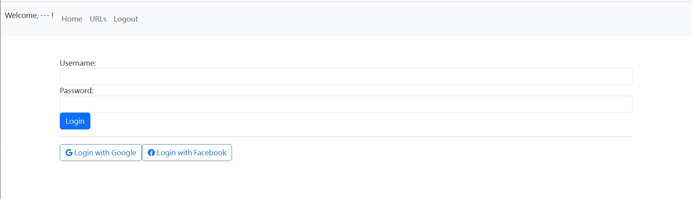
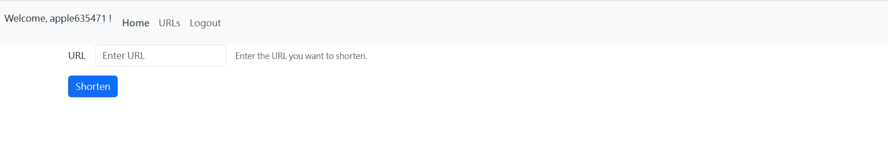
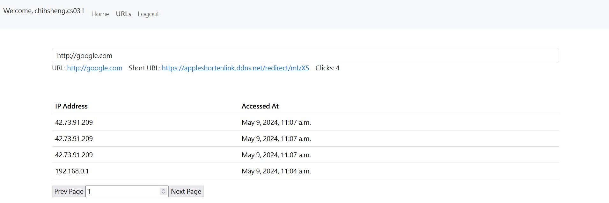

## Demo

* [https://appleshortenlink.ddns.net/](https://appleshortenlink.ddns.net/)

## How to use

* Login Page (Google Login / Facebook Login)


* Home Page - insert the URL you want to shorten, then click `Shorten`


* URLs Page - select which short URL you want to check, and the following table records it's clicking history


## Run by Docker Compose

1. create .env for your sensitive info 
    * DJANGO_SECRET_KEY_BASE64
    * GOOGLE_OAUTH_CLIENT_ID
    * GOOGLE_OAUTH_SECRET
    * FACEBOOK_OAUTH_CLIENT_ID
    * FACEBOOK_OAUTH_SECRET
    * ALLOW_ADMIN_HOST (Optional - if you don't want others to touch your admin page, just set up)
```
DJANGO_SECRET_KEY_BASE64=XXXXXXXXXXXXXXXXXXXXXXX
GOOGLE_OAUTH_CLIENT_ID=XXXXXXXXXXXXXXXXXXXXXXX
GOOGLE_OAUTH_SECRET=XXXXXXXXXXXXXXXXXXXXXXX
FACEBOOK_OAUTH_CLIENT_ID=XXXXXXXXXXXXXXXXXXXXXXX
FACEBOOK_OAUTH_SECRET=XXXXXXXXXXXXXXXXXXXXXXX
ALLOW_ADMIN_HOST=XXXXXXXX
```
2. (optional) https related modification
    1. register hostname for your service's public ip, e.g. by noip
    2. setup a nginx as a reverse proxy server for your application
    3. use certbot to apply free SSL certificate of Let's Encrypt
    4. modify some django settings

skip to next step if want deploy in local
```=
# nginx setup reference
# /etc/nginx/conf.d/shortenlink.conf
# run $ sudo nginx -s reload  
server {
    listen 80;
    server_name {Your-Host-Name};

    location / {
        proxy_pass http://127.0.0.1:8000; # port mapping for django
        proxy_set_header Host $host;
        proxy_set_header X-Real-IP $remote_addr;
        proxy_set_header X-Forwarded-For $proxy_add_x_forwarded_for;
        proxy_set_header X-Forwarded-Proto https; # for correct redirect in django
    }
}
```
```=
# install cerbot in Ubuntu
sudo apt-get update
sudo apt-get install software-properties-common
sudo add-apt-repository universe
sudo add-apt-repository ppa:certbot/certbot
sudo apt-get update
sudo apt-get install certbot python3-certbot-nginx

# run cerbot to apply & set your certificate
sudo certbot --nginx
```
```
# add your hostname to ALLOWED_HOSTS
ALLOWED_HOSTS = ["appleshortenlink.ddns.net"]

# add your hostname to CSRF_TRUSTED_ORIGINS
CSRF_TRUSTED_ORIGINS = ['https://appleshortenlink.ddns.net']

# make sure disable DEBUG in production
DEBUG = False
```

3. create OAuth credentials (Google)
```
1. go to Google Cloud
2. create any project
3. go to `APIs & Services`
4. register APP in `OAuth consent screen`
5. register OAuth credential (since allauth, need specified redirect link)
    * local development - http://127.0.0.1:8000/accounts/google/login/callback/
    * in production - https://{Your-Host-Name}/accounts/google/login/callback/
```

4. create OAuth credentials (Facebook)
```
1. go to `Meta for Developers`
2. create `Facebook Login` application platform
3. click `dashboard` for your platform & define your login app
4. set OAuth redirect URI
    * local development - http://127.0.0.1:8000/accounts/google/login/callback/
    * in production - https://{Your-Host-Name}/accounts/google/login/callback/
```

5. docker compose run
```
docker compose up 
```

6. create admin to monitor db
```
docker exec -it shortenlink-web-1 /bin/bash
cd shortenlink/
python manage.py createsuperuser
```

7. open browser (user)
```
# local development
http://127.0.0.1:8000/

# in production
https://{Your-Host-Name}/
```

8. open browser (admin)
```
# local development
http://127.0.0.1:8000/admin/

# in production
https://{Your-Host-Name}/admin/
```